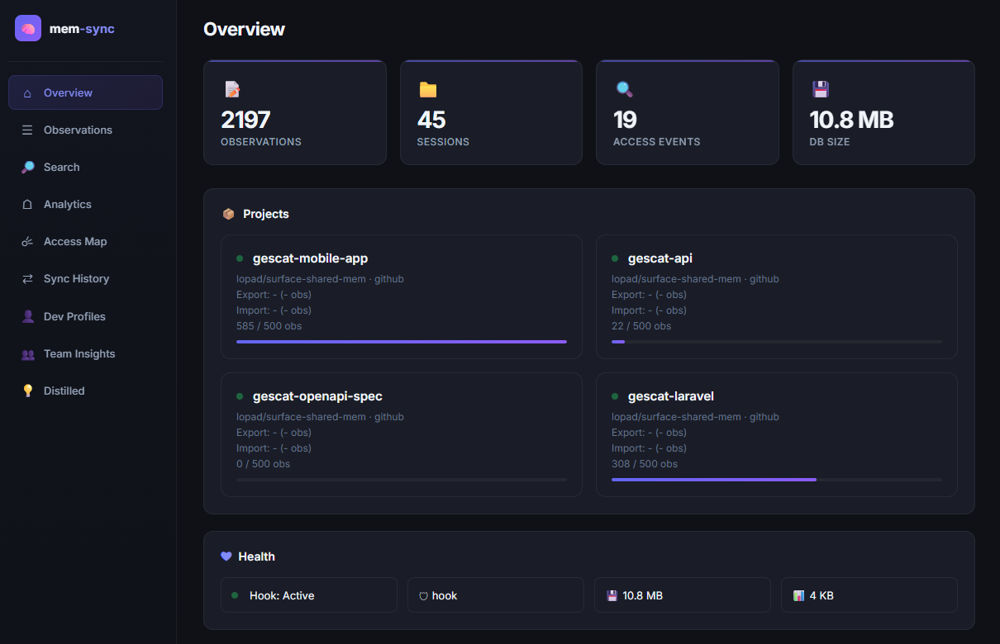
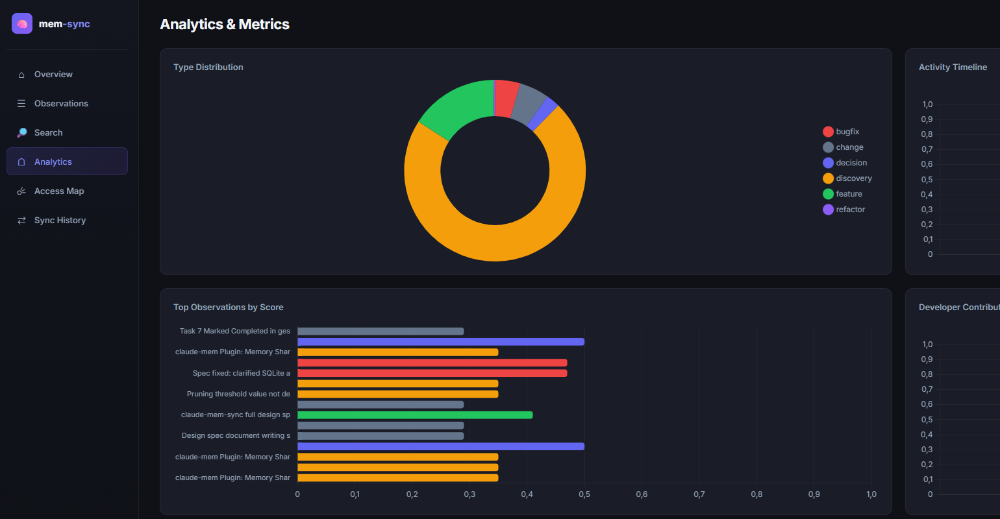
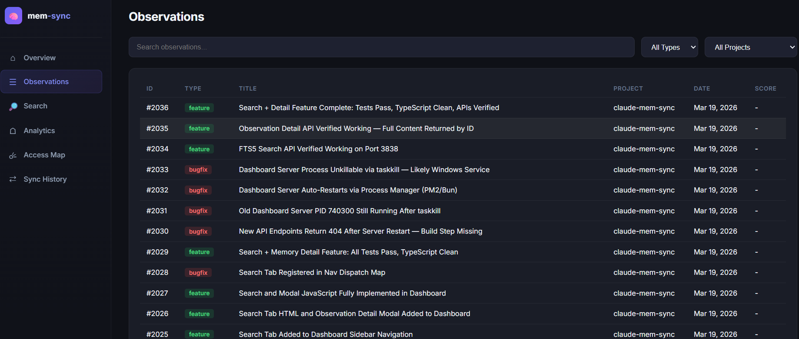
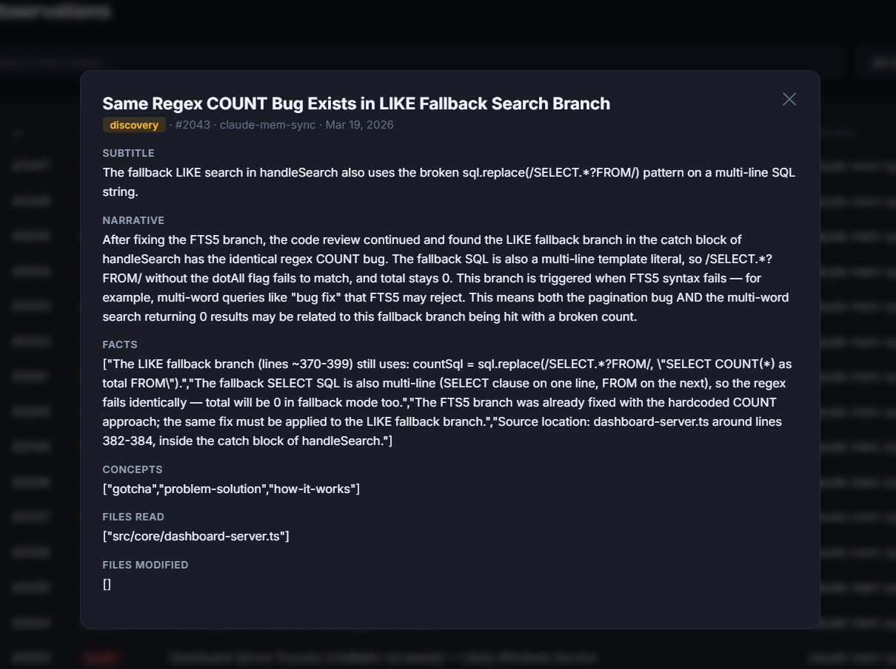
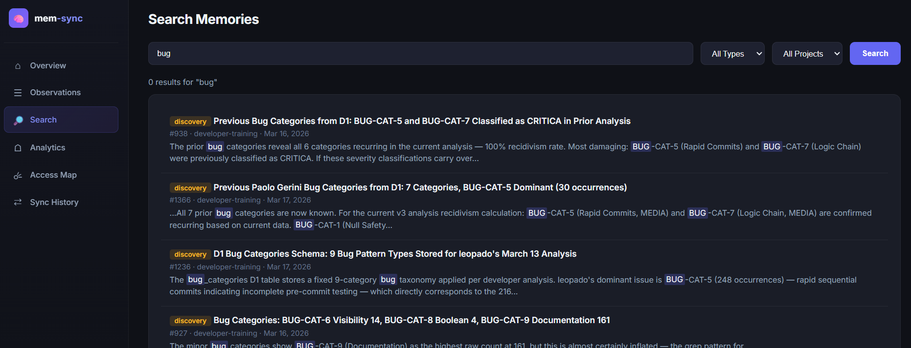

# claude-mem-sync

> Team memory sharing for [claude-mem](https://docs.claude-mem.ai) — sync AI memories across developers via git.



---

## Table of Contents

- [Why This Exists](#why-this-exists)
- [What It Does](#what-it-does)
- [Step-by-Step Setup Guide](#step-by-step-setup-guide)
  - [Step 1: Install Prerequisites](#step-1-install-prerequisites)
  - [Step 2: Install claude-mem-sync](#step-2-install-claude-mem-sync)
  - [Step 3: Install the Claude Code Plugin](#step-3-install-the-claude-code-plugin)
  - [Step 4: Run the Setup Wizard](#step-4-run-the-setup-wizard)
  - [Step 5: Create the Shared Team Repository](#step-5-create-the-shared-team-repository)
  - [Step 6: Set Up GitHub Actions (CI/CD)](#step-6-set-up-github-actions-cicd)
  - [Step 7: Your First Export](#step-7-your-first-export)
  - [Step 8: Import Team Memories](#step-8-import-team-memories)
  - [Step 9: Enable Developer Profiles](#step-9-enable-developer-profiles)
  - [Step 10: Enable Knowledge Distillation (optional)](#step-10-enable-knowledge-distillation-optional)
  - [Step 11: Launch the Dashboard](#step-11-launch-the-dashboard)
  - [Step 12: Set Up Automatic Scheduling (optional)](#step-12-set-up-automatic-scheduling-optional)
- [Configuration Reference](#configuration-reference)
- [CLI Reference](#cli-reference)
- [Web Dashboard](#web-dashboard)
- [Developer Knowledge Profiles](#developer-knowledge-profiles)
- [Knowledge Distillation](#knowledge-distillation)
- [Eviction & Scoring](#eviction--scoring)
- [Destination Patterns](#destination-patterns)
- [Maintenance](#maintenance)
- [Security & Privacy](#security--privacy)
- [Architecture](#architecture)
- [Troubleshooting](#troubleshooting)
- [License](#license)

---

## Why This Exists

**claude-mem** gives Claude persistent memory across sessions, storing observations (decisions, bugfixes, discoveries) in a local SQLite database. But it's designed for **single-user, per-machine** usage.

When a team works on the same project:

- Each developer has their own isolated memory database
- Developer A discovers a critical pattern — developers B through L never learn about it
- The same bugs get rediscovered, the same decisions re-debated
- There is no native team mode, no shared database, no automatic sync

**claude-mem-sync** bridges this gap with filtered, scored, deduplicated team memory sharing using git as the transport layer.

## What It Does

```
Developer A                    GitHub (shared repo)              Developer B
┌──────────┐    export         ┌──────────────────┐    import   ┌──────────┐
│ claude-   │ ──────────────►  │ contributions/   │  ◄───────── │ claude-  │
│ mem.db    │    (filtered)    │   dev-A/         │  (merged)   │ mem.db   │
│           │                  │   dev-B/         │             │          │
│           │    import        │                  │   export    │          │
│           │ ◄──────────────  │ merged/          │ ──────────► │          │
│           │    (deduped)     │   latest.json    │  (filtered) │          │
└──────────┘                   └──────────────────┘             └──────────┘
                                    ▲
                               GitHub Action
                               (merge + dedup + cap)
                                    │
                          ┌─────────┴──────────┐
                          ▼                    ▼
                    ┌────────────┐      ┌────────────┐
                    │  profiles/ │      │ distilled/ │
                    │  per-dev   │      │ rules.md   │
                    │  metrics   │      │ kb.md      │
                    └────────────┘      └────────────┘
                    (deterministic)     (LLM-powered)
```

**Features:**

- **Filtered export** — only share what matters (by type, keyword, or tag)
- **Intelligent eviction** — scoring system prevents unbounded DB growth
- **Deduplication** — composite key dedup across developers
- **Access tracking** — PostToolUse hook tracks which memories Claude actually uses
- **Cross-platform scheduling** — automatic export/import via cron, launchd, or Task Scheduler
- **PR review mode** — optional human review before memories enter the shared repo
- **Multi-provider support** — GitHub, GitLab, and Bitbucket (including self-hosted)
- **CI merge bot** — templates for GitHub Actions, GitLab CI, and Bitbucket Pipelines
- **Web dashboard** — 9-tab dark-theme UI with charts, heatmaps, profiles, and analytics
- **Rich analytics** — type distribution, access patterns, developer contributions, observation scoring
- **Developer knowledge profiles** — per-dev metrics: knowledge spectrum, concept map, file coverage, temporal patterns, survival rate
- **Knowledge distillation** — LLM-powered extraction of CLAUDE.md rules and knowledge docs from team observations
- **Team insights** — knowledge gaps detection, concept coverage heatmaps, bus-factor risk analysis
- **Dual runtime** — works with both Bun and Node.js (v18+)
- **Configurable cleanup** — automatic retention policy for old contribution files

---

## Step-by-Step Setup Guide

This guide walks you through the **complete setup** of claude-mem-sync, from zero to a fully working team memory sharing pipeline. Follow each step in order.

### Step 1: Install Prerequisites

Before you start, make sure you have these tools installed on your machine.

#### 1.1 — Install Bun (recommended) or Node.js

You need **one** of these runtimes. Bun is recommended because it's faster and has built-in SQLite.

**Option A: Install Bun** (recommended)

```bash
# macOS / Linux
curl -fsSL https://bun.sh/install | bash

# Windows (PowerShell)
powershell -c "irm bun.sh/install.ps1 | iex"

# Verify it works
bun --version   # Should print 1.x.x or higher
```

**Option B: Install Node.js** (if you can't use Bun)

Download from [nodejs.org](https://nodejs.org/) (v18 or later), or:

```bash
# macOS (Homebrew)
brew install node

# Verify it works
node --version   # Should print v18.x.x or higher
npm --version    # Should print 9.x.x or higher
```

#### 1.2 — Install Git

```bash
# macOS (Homebrew)
brew install git

# Ubuntu/Debian
sudo apt install git

# Windows — download from https://git-scm.com/

# Verify it works
git --version
```

#### 1.3 — Install GitHub CLI (required for PR mode and repo creation)

```bash
# macOS (Homebrew)
brew install gh

# Ubuntu/Debian
sudo apt install gh

# Windows (winget)
winget install GitHub.cli

# Log in to GitHub
gh auth login

# Verify it works
gh --version
```

#### 1.4 — Install claude-mem

claude-mem-sync reads from claude-mem's database. You need claude-mem installed and already generating observations.

Follow the [claude-mem installation guide](https://docs.claude-mem.ai) to set it up.

After installation, verify you have a database file at:
- **Default location**: `~/.claude-mem/claude-mem.db`

```bash
# Check the file exists
ls -la ~/.claude-mem/claude-mem.db
```

> **Don't have observations yet?** Use Claude Code for a few sessions first. claude-mem automatically records decisions, bugfixes, and discoveries as you work.

---

### Step 2: Install claude-mem-sync

```bash
# With Bun (recommended — faster, built-in SQLite)
bun add -g github:lopadova/claude-mem-sync

# OR with npm / Node.js (uses better-sqlite3 as SQLite driver)
npm install -g github:lopadova/claude-mem-sync

# Verify it works
mem-sync --version   # Should print: claude-mem-sync v1.0.0
mem-sync --help      # Should show the list of commands
```

If `mem-sync` is not found, make sure your global npm/bun bin directory is in your PATH:

```bash
# For Bun — check where global packages go
bun pm bin -g

# For Node.js — check where global packages go
npm bin -g
```

---

### Step 3: Install the Claude Code Plugin

The plugin adds a **PostToolUse hook** that tracks which memories Claude actually reads during your sessions. This enables the "hook mode" eviction strategy which is much smarter than passive mode.

```bash
# Navigate to where claude-mem-sync is installed
cd $(npm root -g)/claude-mem-sync

# Add it as a Claude Code plugin
claude /plugin add .
```

Verify the plugin is active:

```bash
claude /plugin list
# You should see claude-mem-sync in the list
```

> **What does this hook do?** Every time Claude reads a memory (via the `mcp__plugin_claude-mem_mcp-search__*` tools), the hook records which observations were accessed. This data is used to compute more accurate eviction scores — memories that are actually used by Claude get higher scores and survive longer.

---

### Step 4: Run the Setup Wizard

The interactive wizard creates your configuration file at `~/.claude-mem-sync/config.json`.

```bash
mem-sync init
```

The wizard will ask you:

1. **Your developer name** — a unique identifier (e.g., `alice`, `bob`). This appears in contribution file paths and exported JSON.

2. **claude-mem database path** — press Enter to accept the default (`~/.claude-mem/claude-mem.db`), or provide a custom path if you installed claude-mem elsewhere.

3. **Project configuration** — for each project you want to sync:
   - **Project name** — a short identifier (e.g., `my-app`, `backend-api`)
   - **Remote repo** — the GitHub repo in `owner/name` format (e.g., `my-org/dev-memories`)
   - **Auto-merge** — `yes` to push directly, `no` to create Pull Requests for review
   - **Export filters** — which observation types/keywords/tags to export

Here's what a typical config looks like after the wizard:

```json
{
  "global": {
    "devName": "alice",
    "claudeMemDbPath": "~/.claude-mem/claude-mem.db",
    "evictionStrategy": "passive",
    "evictionKeepTagged": ["#keep"],
    "mergeCapPerProject": 500,
    "exportSchedule": "friday:16:00",
    "logLevel": "info",
    "profiles": { "enabled": false, "anonymizeOthers": true },
    "distillation": { "enabled": false, "allowExternalApi": false }
  },
  "projects": {
    "my-app": {
      "enabled": true,
      "remote": {
        "type": "github",
        "repo": "my-org/dev-memories",
        "branch": "main",
        "autoMerge": true
      },
      "export": {
        "types": ["decision", "bugfix", "feature", "discovery"],
        "keywords": ["architecture", "breaking"],
        "tags": ["#shared"]
      }
    }
  }
}
```

> **Tip**: You can edit `~/.claude-mem-sync/config.json` manually at any time to change settings.

---

### Step 5: Create the Shared Team Repository

You need a **private GitHub repository** where all team members push their memory exports. This is where the merge bot runs.

```bash
# Create a new private repo on GitHub
gh repo create my-org/dev-memories --private --description "Shared AI memories for the team"

# Clone it to your machine
gh repo clone my-org/dev-memories
cd dev-memories

# Create the directory structure
mkdir -p contributions merged profiles distilled .github/workflows
```

> **Important**: This repo should be **private**. Observations can contain code snippets, internal URLs, and technical decisions you don't want public.

---

### Step 6: Set Up GitHub Actions (CI/CD)

GitHub Actions will automatically merge contribution files when developers push exports. Copy the templates from your claude-mem-sync installation.

#### 6.1 — Add the Merge Workflow

This workflow triggers every time a developer pushes a contribution file. It merges all contributions, deduplicates, applies eviction caps, and generates developer profiles.

```bash
# Make sure you're in the shared repo directory
cd dev-memories

# Copy the merge workflow template
cp $(npm root -g)/claude-mem-sync/templates/github-action/merge-memories.yml .github/workflows/

# Copy the gitignore template
cp $(npm root -g)/claude-mem-sync/templates/.gitignore.example .gitignore
```

The merge workflow will:
1. Detect new files in `contributions/`
2. Run `mem-sync ci-merge` to merge + dedup + cap at 500 observations
3. Generate developer profiles in `profiles/`
4. Commit and push the merged result

#### 6.2 — Add the Distillation Workflow (optional)

If you want LLM-powered knowledge distillation (extracting rules and knowledge docs from merged observations), add the distillation workflow:

```bash
cp $(npm root -g)/claude-mem-sync/templates/github-action/distill-knowledge.yml .github/workflows/
```

This workflow requires an Anthropic API key. Add it as a repository secret:

```bash
# Go to: https://github.com/my-org/dev-memories/settings/secrets/actions
# Click "New repository secret"
# Name: ANTHROPIC_API_KEY
# Value: your Anthropic API key (starts with sk-ant-)
```

Or via the CLI:

```bash
gh secret set ANTHROPIC_API_KEY --repo my-org/dev-memories
# Paste your API key when prompted
```

#### 6.3 — Commit and Push

```bash
git add -A
git commit -m "chore: initial setup for team memory sharing"
git push
```

#### 6.4 — Invite Your Team

Add your team members as collaborators so they can push their exports:

```bash
gh repo edit my-org/dev-memories --add-collaborator teammate-username
```

Each team member needs to:
1. Install claude-mem-sync (Step 2)
2. Install the plugin (Step 3)
3. Run `mem-sync init` (Step 4) — using the **same repo** (`my-org/dev-memories`) but their **own devName**

---

### Step 7: Your First Export

Now let's export your memories to the shared repo.

#### 7.1 — Preview What Would Be Exported

Always preview first to make sure your filters are working correctly:

```bash
mem-sync preview --project my-app
```

This shows you:
- How many observations match your filters
- The type, date, and title of each matched observation
- The total export size

If nothing matches, check your filter config in `~/.claude-mem-sync/config.json`. Make sure `export.types` includes the types you want (e.g., `["decision", "bugfix"]`).

#### 7.2 — Export

```bash
mem-sync export --project my-app
```

This will:
1. Query your local claude-mem database
2. Filter observations based on your config
3. Clone the shared repo
4. Write a JSON file to `contributions/my-app/alice/2026-03-19T18-30-00.json`
5. Git commit and push

#### 7.3 — Verify on GitHub

Go to `https://github.com/my-org/dev-memories` and check:
- Your contribution file should appear in `contributions/my-app/your-name/`
- The GitHub Action should trigger automatically
- After the Action runs, `merged/my-app/latest.json` should be updated

---

### Step 8: Import Team Memories

Once other team members have exported their memories and the merge bot has processed them, you can import the merged result into your local database.

```bash
# Import for a specific project
mem-sync import --project my-app

# Or import all enabled projects at once
mem-sync import --all
```

This will:
1. Clone the shared repo
2. Read `merged/my-app/latest.json`
3. Deduplicate against your existing observations
4. Insert new observations into your local claude-mem database

After importing, Claude will have access to your teammates' discoveries, decisions, and bugfixes during your sessions.

---

### Step 9: Enable Developer Profiles

Developer profiles analyze each team member's contributions and compute metrics like knowledge spectrum, concept coverage, and contribution quality. No LLM needed — fully deterministic, zero cost.

#### 9.1 — Enable in Config

Open `~/.claude-mem-sync/config.json` and set:

```json
{
  "global": {
    "profiles": {
      "enabled": true,
      "anonymizeOthers": true
    }
  }
}
```

#### 9.2 — Generate Profiles Locally

```bash
# Preview what profiles would be generated
mem-sync profile --project my-app --dry-run

# Generate all profiles
mem-sync profile --project my-app

# Generate just your profile
mem-sync profile --project my-app --dev alice

# Also generate markdown (human-readable)
mem-sync profile --project my-app --format md
```

This creates files in `profiles/my-app/`:

```
profiles/
  my-app/
    alice/
      profile.json       # Your full profile data
      profile.md          # Human-readable version
    bob/
      profile.json
    team-overview.json    # Team aggregate stats
```

#### 9.3 — What's in a Profile

Each profile contains:

- **Knowledge Spectrum** — what types of observations you create (e.g., 40% decisions, 30% bugfixes) vs team average
- **Concept Map** — which concepts you cover and which ones you haven't touched that the team has (knowledge gaps)
- **File Coverage** — which directories and files you've worked on, plus a specialization index
- **Temporal Pattern** — how consistently you contribute (observations per week, consistency score)
- **Survival Rate** — what percentage of your exported observations survived the merge process (quality proxy)

> **Note**: Profiles are automatically generated in CI after each merge if you followed Step 6. You can also run them locally anytime.

---

### Step 10: Enable Knowledge Distillation (optional)

Knowledge distillation uses Claude (via the Anthropic API) to analyze your team's merged observations and extract:
- **Rules** — actionable CLAUDE.md-compatible rules with confidence scores
- **Knowledge Base** — grouped knowledge documentation by concept clusters

> **Cost**: approximately $0.33 per run for 500 observations. See the [cost estimation table](#cost-estimation).

#### 10.1 — Get an Anthropic API Key

1. Go to [console.anthropic.com](https://console.anthropic.com/)
2. Create an account (or log in)
3. Go to **API Keys** and create a new key
4. Copy the key (it starts with `sk-ant-`)

#### 10.2 — Enable in Config

Open `~/.claude-mem-sync/config.json` and set:

```json
{
  "global": {
    "distillation": {
      "enabled": true,
      "allowExternalApi": true,
      "model": "claude-sonnet-4-20250514",
      "minObservations": 20
    }
  }
}
```

> **Both `enabled` and `allowExternalApi` must be `true`**. This double opt-in is intentional — it ensures you consciously decide to send observation data to the Anthropic API.

#### 10.3 — Run a Dry Run First

```bash
# Set your API key (or pass it with --api-key)
export ANTHROPIC_API_KEY=sk-ant-your-key-here

# Preview without making an API call
mem-sync distill --project my-app --dry-run
```

This shows you:
- How many observations would be sent
- Estimated token count
- Estimated cost

#### 10.4 — Run Distillation

```bash
mem-sync distill --project my-app
```

This creates files in `distilled/my-app/`:

```
distilled/
  my-app/
    rules.md                    # CLAUDE.md-compatible rules
    knowledge-base.md           # Grouped knowledge documentation
    distillation-report.json    # Run metadata (tokens, cost, stats)
    feedback.json               # Rule accept/reject tracking
```

#### 10.5 — Review the Output

Open `distilled/my-app/rules.md` to see the extracted rules. Each rule has:
- The rule statement (imperative, actionable)
- Rationale (why this rule exists)
- Confidence score (50%–100%)
- Evidence count and type breakdown

**Rules are suggestions** — they are never auto-merged into your CLAUDE.md. Review them, and copy the ones you agree with into your project's CLAUDE.md manually.

#### 10.6 — Automate in CI (optional)

If you added the distillation workflow in Step 6.2, it runs automatically after each merge and creates a Pull Request with the distilled output. This PR needs human review before merging.

---

### Step 11: Launch the Dashboard

The web dashboard gives you a visual overview of everything: observations, profiles, team insights, distilled knowledge, and more.

```bash
mem-sync dashboard
```

Open your browser at **http://localhost:3737**.

The dashboard has 9 tabs:

| Tab | What you'll see |
|-----|-----------------|
| **Overview** | Total observations, sessions, access events, DB size, project health cards |
| **Observations** | Searchable table of all observations, click any row to see details |
| **Search** | Full-text search (supports AND, OR, NOT, "exact phrases") |
| **Analytics** | Charts: type distribution, activity timeline, top scored, dev contributions |
| **Access Map** | GitHub-style heatmap showing when memories are accessed |
| **Sync History** | Export/import history with charts and tables |
| **Dev Profiles** | Select a developer to see their knowledge spectrum, concepts, file coverage, activity patterns |
| **Team Insights** | Team averages, concept coverage chart, knowledge gap detection (bus-factor risks) |
| **Distilled** | Distilled rules, knowledge base, report stats, API cost tracking |

To use a custom port:

```bash
mem-sync dashboard --port 8080
```

---

### Step 12: Set Up Automatic Scheduling (optional)

Instead of running `mem-sync export` and `mem-sync import` manually, you can schedule them to run automatically.

#### Automatic (all platforms)

```bash
# Detect your OS and install scheduled tasks
mem-sync schedule install

# To remove them later
mem-sync schedule remove
```

#### Manual: Linux (cron)

```cron
# Export every Friday at 16:00
0 16 * * 5 mem-sync export --all >> ~/.claude-mem-sync/logs/export.log 2>&1

# Import every Saturday at 09:00
0 9 * * 6 mem-sync import --all >> ~/.claude-mem-sync/logs/import.log 2>&1

# Monthly maintenance (1st of month at 03:00)
0 3 1 * * mem-sync maintain >> ~/.claude-mem-sync/logs/maintain.log 2>&1
```

#### Manual: macOS (launchd)

`mem-sync schedule install` creates plist files in `~/Library/LaunchAgents/`.

#### Manual: Windows (Task Scheduler)

```powershell
schtasks /create /tn "claude-mem-sync-export" /tr "mem-sync export --all" /sc weekly /d FRI /st 16:00 /rl LIMITED /f
schtasks /create /tn "claude-mem-sync-import" /tr "mem-sync import --all" /sc weekly /d SAT /st 09:00 /rl LIMITED /f
schtasks /create /tn "claude-mem-sync-maintain" /tr "mem-sync maintain" /sc monthly /d 1 /st 03:00 /rl LIMITED /f
```

---

## Configuration Reference

Config file location: `~/.claude-mem-sync/config.json`

Created by `mem-sync init` or manually. See `templates/config.example.json` for a full example.

### Global Settings

| Field | Type | Default | Description |
|-------|------|---------|-------------|
| `devName` | string | **required** | Your developer identifier |
| `evictionStrategy` | `"hook"` \| `"passive"` | `"passive"` | Default eviction strategy |
| `evictionKeepTagged` | string[] | `["#keep"]` | Tags that protect observations from eviction |
| `maintenanceSchedule` | `"weekly"` \| `"biweekly"` \| `"monthly"` | `"monthly"` | Auto-maintenance frequency |
| `maintenancePruneOlderThanDays` | number | `90` | Max age for low-value observations |
| `maintenancePruneScoreThreshold` | number | `0.3` | Score threshold for pruning |
| `mergeCapPerProject` | number | `500` | Max observations in merged output |
| `exportSchedule` | string | `"friday:16:00"` | Default export schedule |
| `logLevel` | string | `"info"` | Log verbosity |
| `claudeMemDbPath` | string | `~/.claude-mem/claude-mem.db` | Path to claude-mem's database |
| `contributionRetentionDays` | number | `30` | Days to keep processed contribution files before auto-cleanup |
| `profiles.enabled` | boolean | `false` | Enable developer knowledge profile generation |
| `profiles.anonymizeOthers` | boolean | `true` | Show "your data vs team average" — never name other devs |
| `distillation.enabled` | boolean | `false` | Enable LLM-powered knowledge distillation |
| `distillation.model` | string | `"claude-sonnet-4-20250514"` | Anthropic model for distillation |
| `distillation.schedule` | `"after-merge"` \| `"weekly"` \| `"manual"` | `"after-merge"` | When to run distillation |
| `distillation.excludeTypes` | string[] | `[]` | Observation types to exclude from distillation |
| `distillation.minObservations` | number | `20` | Minimum observations required to run distillation |
| `distillation.reviewers` | string[] | `[]` | GitHub usernames to request review on distillation PRs |
| `distillation.maxTokenBudget` | number | `100000` | Max estimated tokens per API call |
| `distillation.allowExternalApi` | boolean | `false` | Must be `true` to send data to Anthropic API |

### Per-Project Settings

| Field | Type | Default | Description |
|-------|------|---------|-------------|
| `enabled` | boolean | `true` | Whether this project participates in sync |
| `memProject` | string | key name | Project name in claude-mem's DB |
| `remote.type` | `"github"` \| `"gitlab"` \| `"bitbucket"` | `"github"` | Git provider |
| `remote.repo` | string | **required** | Repo in `owner/name` format |
| `remote.branch` | string | `"main"` | Branch to push/pull |
| `remote.autoMerge` | boolean | `true` | Push directly or create PR/MR |
| `remote.host` | string | auto | Custom host for self-hosted instances (e.g., `git.company.com`) |
| `export.types` | string[] | `[]` | Observation types to export |
| `export.keywords` | string[] | `[]` | Keywords to match |
| `export.tags` | string[] | `[]` | Tags to match (e.g., `#shared`) |
| `export.schedule` | string | inherits global | Per-project schedule override |

### Filter Logic

Filters are combined with **OR**. An observation is exported if it matches **any** criterion:

```
exported = matchesType(obs, types) OR matchesKeyword(obs, keywords) OR matchesTag(obs, tags)
```

If all filter arrays are empty, **nothing is exported** (safe default — you won't accidentally leak data).

### Tag System

claude-mem has no native tag system. Tags like `#shared` and `#keep` work via free-text search across the `title`, `narrative`, and `text` fields of observations.

- **`#shared`** — mark observations for team export
- **`#keep`** — protect observations from eviction (score = Infinity)

## CLI Reference

| Command | Description |
|---------|-------------|
| `mem-sync init` | Interactive setup wizard |
| `mem-sync export [--project X] [--all] [--dry-run]` | Export filtered memories to git |
| `mem-sync import [--project X] [--all]` | Import merged memories from git |
| `mem-sync preview [--project X] [--all]` | Dry-run: show what would be exported |
| `mem-sync maintain` | Database maintenance (backup, prune, vacuum) |
| `mem-sync status` | Health check (DB sizes, counts, hook status) |
| `mem-sync schedule install` | Install OS scheduled tasks |
| `mem-sync schedule remove` | Remove scheduled tasks |
| `mem-sync ci-merge` | CI-only: merge contribution files |
| `mem-sync dashboard [--port N]` | Web dashboard (default: http://localhost:3737) |
| `mem-sync profile [--dev X] [--project X] [--format md\|json]` | Generate developer knowledge profiles |
| `mem-sync distill --project X [--api-key KEY] [--dry-run]` | LLM-powered knowledge distillation |

## Web Dashboard

Launch a local web dashboard to visualize your team's shared memories, access patterns, profiles, and distilled knowledge.

```bash
mem-sync dashboard              # http://localhost:3737
mem-sync dashboard --port 8080  # custom port
```

### Screenshots







### Tabs

| Tab | What it shows |
|-----|---------------|
| **Overview** | Stat cards (observations, sessions, access events, DB size), project cards with merge cap progress bars, health indicators |
| **Observations** | Full-text search, type/project filters, paginated table with eviction scores, click-to-detail modal |
| **Search** | FTS5 full-text search with `AND`, `OR`, `NOT`, `"exact phrase"` syntax, type/project filters, snippet highlighting |
| **Analytics** | Type distribution (doughnut chart), activity timeline (line chart), top observations by score (horizontal bar), developer contributions (grouped bar) |
| **Access Map** | GitHub-style heatmap of daily access patterns (6 months), top 20 most accessed observations with bar indicators |
| **Sync History** | Monthly export/import stacked bar chart, recent exports table, recent imports table |
| **Dev Profiles** | Developer selector dropdown, knowledge spectrum doughnut chart (your types vs team average), top concepts bar chart (you vs team), monthly activity line chart, file coverage bar chart, KPI cards (total obs, concept coverage %, survival rate %, avg/week) |
| **Team Insights** | Team KPI cards (devs, avg obs/dev, avg survival rate, avg concept coverage), team type distribution doughnut, concept coverage bar chart (red = knowledge gaps), knowledge gaps table with bus-factor risk indicators |
| **Distilled** | Distilled rules rendered as markdown, knowledge base content, report KPI cards (rules generated, avg confidence, knowledge sections, API cost + token usage) |

### API Endpoints

| Endpoint | Method | Description |
|----------|--------|-------------|
| `/api/overview` | GET | Overview stats, project list, DB sizes |
| `/api/observations` | GET | Paginated observations with search/filter |
| `/api/observations/:id` | GET | Single observation detail |
| `/api/search` | GET | FTS5 search with pagination |
| `/api/analytics/types` | GET | Type distribution counts |
| `/api/analytics/timeline` | GET | Monthly sync timeline |
| `/api/analytics/scores` | GET | Observation eviction scores |
| `/api/analytics/devs` | GET | Developer contribution stats |
| `/api/access/top` | GET | Most accessed observations |
| `/api/access/heatmap` | GET | Daily access heatmap data |
| `/api/sync/history` | GET | Export/import history |
| `/api/profiles/devs` | GET | List of developer names |
| `/api/profiles/:devName` | GET | Developer profile data |
| `/api/team/overview` | GET | Team aggregate metrics |
| `/api/team/concepts` | GET | Team concept coverage + knowledge gaps |
| `/api/distilled/rules` | GET | Distilled rules markdown |
| `/api/distilled/kb` | GET | Knowledge base markdown |
| `/api/distilled/report` | GET | Distillation report + feedback |
| `/api/distilled/feedback` | POST | Submit rule accept/reject feedback |

### Design

- Dark theme with glassmorphism cards and gradient accents
- Chart.js 4 for interactive visualizations
- Inter font, animated counters, hover effects
- Responsive layout (sidebar collapses on mobile)
- Zero frameworks — vanilla JS SPA, single HTML file
- Reads directly from local SQLite databases + contribution/profile/distillation files

## Developer Knowledge Profiles

Generate per-developer analytics from contribution and merged data — no LLM required, zero API cost, fully deterministic.

### What It Computes

Each developer profile contains 5 metrics:

| Metric | What it measures |
|--------|-----------------|
| **Knowledge Spectrum** | Type distribution (decision/bugfix/feature/discovery/refactor/change) with counts, percentages, and comparison against team average |
| **Concept Map** | Frequency table of concepts extracted from observations, highlighting concepts the dev hasn't covered vs the team (knowledge gaps) |
| **File Coverage** | Directories and files touched, with a specialization index (1 = concentrated in few dirs, 0 = spread across many) |
| **Temporal Pattern** | Observations per week/month with average and consistency score (1 = steady, 0 = sporadic) |
| **Contribution Survival Rate** | Percentage of the dev's exported observations that survived into the merged set — a natural quality proxy |

### Team Overview

When profiles are generated for multiple developers, a `team-overview.json` is also produced with:

- Total developers count
- Average observations per developer
- Average survival rate across the team
- Average concept diversity (coverage percentage)
- Aggregated type distribution

### Team Concepts & Knowledge Gaps

The team concepts analysis identifies **knowledge bus-factor risks** — concepts known by only 1 developer. Visible in the dashboard's Team Insights tab and available via the `/api/team/concepts` endpoint.

### Privacy Model

- Profiles are opt-in (`enabled: false` default)
- No developer rankings or cross-dev comparisons
- When `anonymizeOthers` is enabled, all comparisons use anonymized team averages
- A developer controls their own visibility by enabling/disabling export

## Knowledge Distillation

Analyze merged team observations with an LLM to extract actionable rules and knowledge documentation. Produces CLAUDE.md-compatible rules and grouped knowledge patterns.

### What It Produces

| Artifact | Description |
|----------|-------------|
| **`rules.md`** | CLAUDE.md-compatible rules with rationale, confidence scores, source evidence counts, and dev diversity metrics. Grouped by category (architecture, testing, security, performance, conventions, workflow, data, dependencies). |
| **`knowledge-base.md`** | Knowledge documentation grouped by concept clusters. Each section includes patterns, anti-patterns, and descriptions synthesized from observations. |
| **`distillation-report.json`** | Machine-readable metadata: input stats, rules/sections generated, confidence distribution, token usage, estimated cost, model used, date range. |
| **`feedback.json`** | Rule feedback tracking: proposed/accepted/rejected/modified status per rule. Used by the dashboard for interactive rule review. |

### How It Works

1. Loads merged observations from `merged/{project}/latest.json`
2. Filters out excluded types (configurable via `distillation.excludeTypes`)
3. Builds a structured prompt with system instructions and observation data
4. Calls the Anthropic Messages API (Claude Sonnet 4 by default)
5. Parses the JSON response using Zod schema validation
6. Writes `rules.md`, `knowledge-base.md`, `distillation-report.json`, and `feedback.json`

### Cost Estimation

| Observations | Input Tokens (est.) | Output Tokens (est.) | Cost per run | Monthly (weekly) |
|-------------|--------------------|--------------------|-------------|-----------------|
| 100 | ~10K | ~5K | ~$0.11 | ~$0.44 |
| 300 | ~30K | ~8K | ~$0.21 | ~$0.84 |
| 500 | ~50K | ~10K | ~$0.33 | ~$1.32 |

Costs based on Claude Sonnet 4 pricing ($3/MTok input, $15/MTok output).

### Rules Quality

Each distilled rule includes:

- **Confidence score** (0.5–1.0) — based on evidence count and developer diversity
- **Source count** — number of observations supporting the rule
- **Source types** — which observation types contributed evidence
- **Dev diversity** — how many different developers contributed supporting observations
- **Category** — architecture, testing, security, performance, conventions, workflow, data, or dependencies

Rules below 0.5 confidence are not included. Rules are suggestions requiring human review — they are **never auto-merged** into CLAUDE.md.

### Feedback Loop

The dashboard's Distilled tab provides accept/reject/modify buttons for each rule. Feedback is stored in `distilled/{project}/feedback.json` and can be incorporated into future distillation runs (the next run can exclude rejected rules).

### Privacy Safeguards

- `allowExternalApi: false` by default — must be explicitly enabled
- Observations are pre-filtered before API calls (optional `excludeTypes`)
- System prompt instructs the LLM: no specific code snippets, file paths, or developer names in output
- Provenance cites counts and types only, not attribution
- Output delivered as PR, never auto-merged

## Eviction & Scoring

### The Problem

Without eviction, databases grow unboundedly. A team of 12 developers sharing weekly would accumulate thousands of observations per project within months.

### Hook Mode (recommended)

Uses real access data from the PostToolUse hook:

```
score = (type_weight * 0.3) + (recency_weight * 0.2) + (access_weight * 0.5)
```

| Component | Formula | Range |
|-----------|---------|-------|
| `type_weight` | Fixed per type (decision=1.0, bugfix=0.9, feature=0.7, discovery=0.5, refactor=0.4, change=0.3) | 0–1 |
| `recency_weight` | `1 / (1 + ln(1 + days_old / 150))` | 0–1 |
| `access_weight` | `accesses / max_accesses` (normalized) | 0–1 |

### Passive Mode (fallback)

No hook required. Uses diffusion across developers as a value proxy:

```
score = (type_weight * 0.4) + (recency_weight * 0.3) + (diffusion_weight * 0.3)
```

`diffusion_weight = devs_who_have_it / total_devs`

### #keep — Protecting Critical Memories

Observations with `#keep` in their title, narrative, or text get `score = Infinity` and are never pruned.

### Configuring Weights

```json
"eviction": {
  "strategy": "hook",
  "scoring": {
    "typeWeight": 0.3,
    "recencyWeight": 0.2,
    "thirdWeight": 0.5
  }
}
```

Weights must sum to 1.0.

## Destination Patterns

### Pattern A: Dedicated repo (recommended)

One repo per team/org for all project memories. Clean separation, one Action to maintain.

### Pattern B: In-project folder

Memories stored in `.shared-memories/` inside each project repo. Simpler but adds JSON to code repos.

### Pattern C: Hybrid

Dedicated repo with a pointer file (`.claude-mem-sync.json`) in each project repo.

| | Dedicated repo | In-project | Hybrid |
|---|---|---|---|
| **Separation** | Clean | Mixed | Clean |
| **Setup** | Extra repo | Zero | Extra repo + pointer |
| **Scalability** | Excellent | Per-project Actions | Excellent |
| **Best for** | Teams of 3+ | Solo / small teams | Large orgs |

## Maintenance

### What `mem-sync maintain` Does

1. **Backup** — copies DB to `claude-mem.db.backup`
2. **Pruning** — removes low-score observations older than threshold (respects `#keep`)
3. **FTS rebuild** — rebuilds all FTS5 indexes
4. **Optimize** — runs `ANALYZE` and `VACUUM`
5. **Integrity check** — if it fails, restores from backup

### Emergency: Restoring from Backup

```bash
cp ~/.claude-mem/claude-mem.db.backup ~/.claude-mem/claude-mem.db
```

## Security & Privacy

### What Gets Exported

Only observations matching your configured filters (types, keywords, tags) are exported. Empty filters = nothing exported.

### Best Practices

- **Always preview first**: `mem-sync preview` before your first export
- **Use PR review mode**: set `autoMerge: false` for human review
- **Private repos only**: the shared memories repo should always be private
- **Review your filters**: observations can contain code with secrets, tokens, or internal URLs

### Developer Profiles Privacy

- **Opt-in**: `profiles.enabled` is `false` by default
- **No rankings**: profiles show individual metrics vs anonymized team average — never cross-developer comparisons
- **`anonymizeOthers: true`** (default): comparisons use "team average", never naming other developers
- **Self-controlled**: a developer controls their visibility by enabling/disabling export

### Knowledge Distillation Privacy

- **Double opt-in**: both `distillation.enabled` and `distillation.allowExternalApi` must be explicitly `true`
- **Type exclusion**: `excludeTypes` keeps sensitive observation types out of API payloads
- **No code/names in output**: system prompt instructs the LLM to never include code snippets, file paths, or developer names
- **PR-based delivery**: distilled output is delivered as a pull request — never auto-merged
- **Provenance by counts**: rules cite "3 bugfix observations" not "from Alice's session"

## Architecture

- **Dual runtime** — works on Bun (v1.0+) and Node.js (v18+) via `src/core/compat.ts` abstraction layer
- **SQLite** — `bun:sqlite` on Bun, `better-sqlite3` on Node.js (auto-detected at startup)
- **Export + hook are read-only** on claude-mem's DB
- **Import is the only write operation** — uses transactions with rollback safety
- **access.db** is a separate tracking database — never touches claude-mem's schema
- **`PRAGMA busy_timeout = 5000`** on all connections for WAL contention handling
- **Multi-provider git** — GitHub, GitLab, Bitbucket with optional self-hosted host override
- **Array-based process spawning** — all shell commands use `child_process.spawn` with array args (no shell injection)
- **Profiler** — reads contribution/merged JSON files, computes metrics deterministically (no LLM, no API)
- **Distiller** — direct `fetch` to Anthropic Messages API (no SDK dependency), Zod-validated structured output
- **Dashboard** — pure Node.js HTTP server, 19 API endpoints, vanilla JS SPA with Chart.js 4

## Troubleshooting

### "Config not found"

Run `mem-sync init` to create the config file.

### "CLI is required for PR-based export"

Install the CLI for your provider:
- **GitHub**: [gh](https://cli.github.com/)
- **GitLab**: [glab](https://gitlab.com/gitlab-org/cli)
- **Bitbucket**: `curl` (uses REST API)

Or set `autoMerge: true` to use direct push instead of PR/MR mode.

### "No observations match export filters"

Check your filter config. Use `mem-sync preview` to see what matches. All empty filters = nothing exported (safe default).

### Hook not tracking accesses

Verify the plugin is installed: `claude /plugin list`. The hook matches tools prefixed with `mcp__plugin_claude-mem_mcp-search__`.

### "Distillation disabled" or "External API disabled"

Both `distillation.enabled` and `distillation.allowExternalApi` must be `true` in your config. This double opt-in is intentional for privacy.

### Profiles show "No contributions found"

Make sure the `contributions/` directory exists and contains exported JSON files. Run `mem-sync export` first, or check that the shared repo has been cloned to the current directory.

## License

MIT

---

<p align="center">Made with &#10084;&#65039; in Florence</p>
