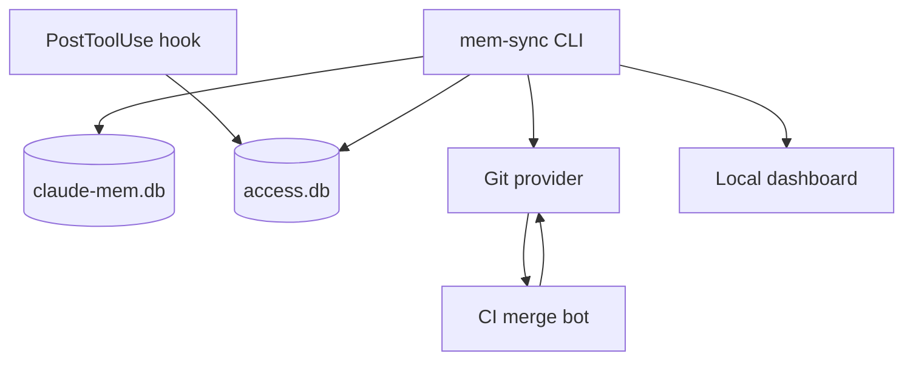

# Architecture Overview

| Component | Responsibility |
| --- | --- |
| CLI | export, import, config, merge, profile, distill, schedule, dashboard |
| Hook | record memory access events |
| Shared repo | transport and audit log |
| CI | merge, dedupe, cap, profile |
| Dashboard | local visibility |

::: callout warning "Write boundary"
Export and hook access are read-only against `claude-mem.db`; import is the write path.
:::

::: collapsible "ADR: Git as transport"
Git gives teams permissions, reviews, CI triggers, history, and rollback without running a new service.
:::
