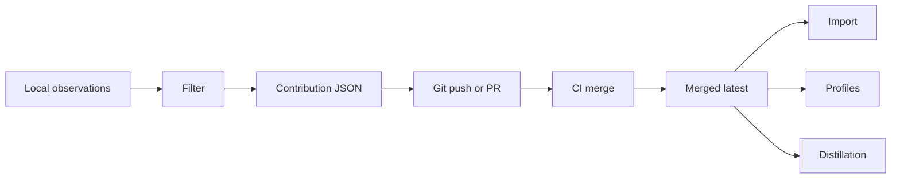

# Pipeline and Workflow



## Worked example

```bash
mem-sync preview --project platform
mem-sync export --project platform
mem-sync profile --project platform --format md
mem-sync import --project platform
```

::: callout danger "Do not hand-edit merged output"
Fix source contributions or merge logic, then rerun `mem-sync ci-merge`.
:::
