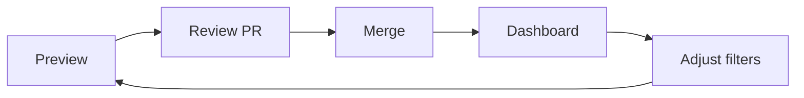

# Filters and Governance

::: tabs
== tab "Small team"
Use explicit `#shared` tags and PR review.

== tab "Mature team"
Allow durable types such as `decision`, `bugfix`, and `discovery`.

== tab "High sensitivity"
Use tag-only export, required PR review, and tighter retention.
:::

::: callout tip "Good shared observations"
Share reusable decisions, debugging findings, architecture constraints, and migration notes.
:::

