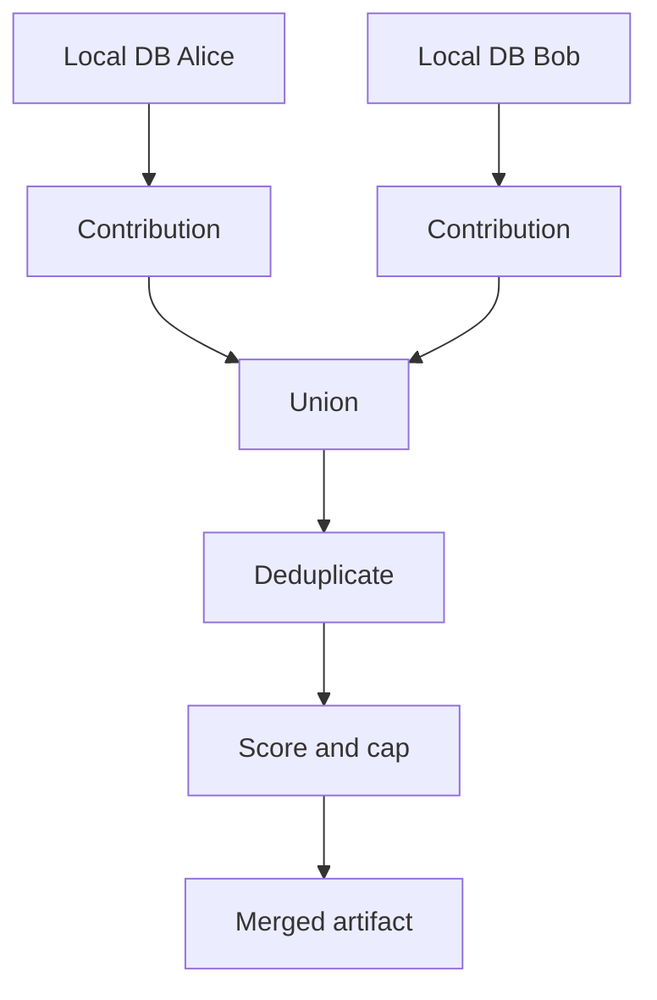

# Memory Sync Model

## Motivazione

Each developer keeps a local database. The shared repo contains selected observations and derived artifacts.

## Teoria

$$
M_{p,t} = cap(dedupe(\bigcup C_{p,d,t}))
$$

`C` is a developer contribution set, `dedupe` removes duplicate observations, and `cap` enforces retention.

::: callout warning "Limit"
The project syncs selected observations, not full Claude session state.
:::
