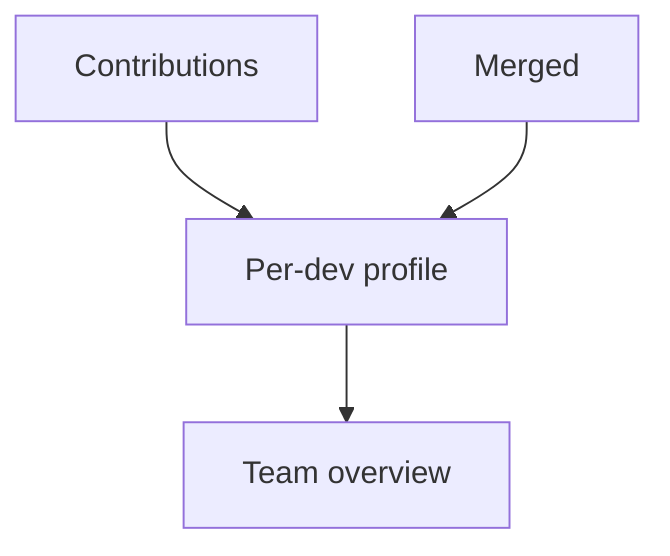

# Profiles and Privacy

Profiles are deterministic analytics over contributions and merged artifacts.

| Metric | Meaning |
| --- | --- |
| Knowledge spectrum | Observation type distribution |
| Concept map | Concepts covered and gaps |
| File coverage | Mentioned files and directories |
| Temporal pattern | Weekly and monthly consistency |
| Survival rate | Exported observations that remain after merge |

::: callout info "Opt-in analytics"
Profiles are disabled by default and can anonymize comparisons to team averages.
:::

::: collapsible "Limit: not rankings"
Profile metrics help spot knowledge gaps. They should not be treated as developer performance rankings.
:::
