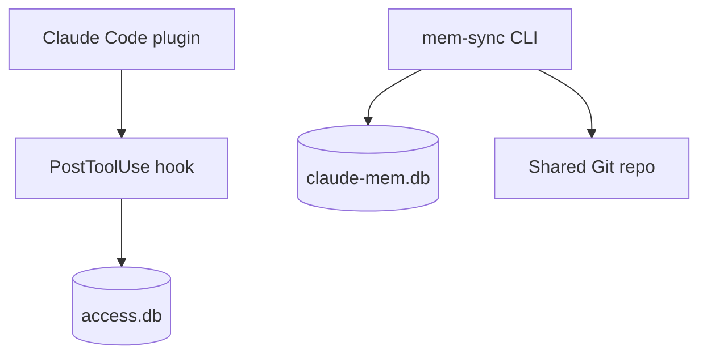

# Installation

## Requirements

| Tool | Purpose |
| --- | --- |
| Node.js 18+ | plugin setup hook and CLI |
| Bun 1+ | recommended package runtime |
| Git | clone, commit, push, and pull memory artifacts |
| GitHub CLI or provider equivalent | PR mode and repo setup |
| claude-mem | source database |

::: tabs
== tab "Plugin"
```bash
claude plugin marketplace add lopadova/claude-mem-sync
claude plugin install claude-mem-sync@claude-mem-sync
```

== tab "Local development"
```bash
git clone https://github.com/lopadova/claude-mem-sync.git
cd claude-mem-sync
bun install
bun run build
npm link
```

== tab "GitHub Packages"
```bash
echo "@lopadova:registry=https://npm.pkg.github.com" >> ~/.npmrc
npm install -g @lopadova/claude-mem-sync
```
:::


