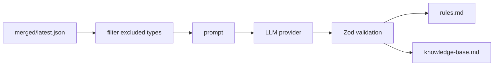

# Distillation

## Motivazione

Distillation turns repeated evidence in merged observations into reviewable rules and knowledge docs.

::: callout danger "Double opt-in"
External API use requires both `distillation.enabled` and `distillation.allowExternalApi`.
:::



```bash
mem-sync distill --project my-app --dry-run
mem-sync distill --project my-app --api-key "$ANTHROPIC_API_KEY"
```

::: collapsible "ADR: never auto-merge rules"
Distilled rules are suggestions. Human review prevents overgeneralization from partial evidence.
:::
