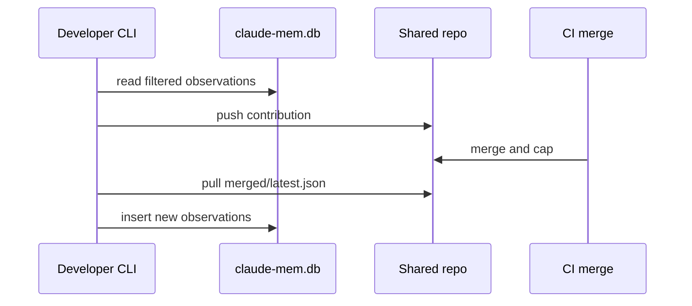

# Export and Import

## Motivazione

Export and import are explicit so developers control what leaves and enters their local memory database.

::: steps
1. **Preview:** `mem-sync preview --project my-app`
2. **Export:** `mem-sync export --project my-app`
3. **Wait for CI:** confirm `merged/my-app/latest.json`
4. **Import:** `mem-sync import --project my-app`
:::

::: callout tip "First rollout"
Use `remote.autoMerge: false` until filters and review policy are validated.
:::
