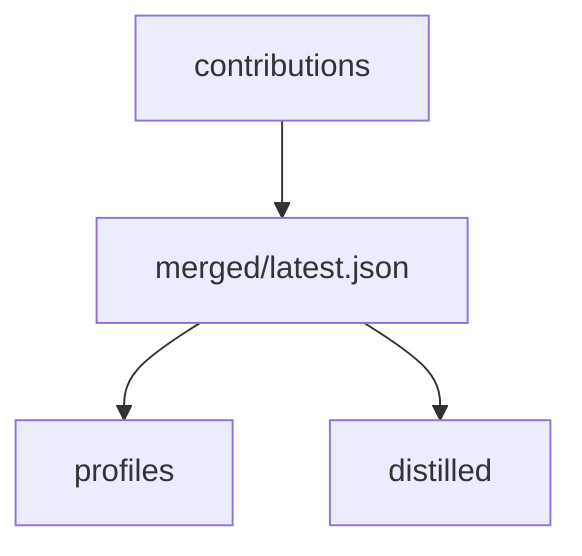

# First Team Repository

## Motivazione

The shared repo is a transport and audit log, not a live database.

::: steps
1. **Create a private repository.**
2. **Scaffold it.**
   ```bash
   mem-sync setup-repo my-team-memories
   ```
3. **Commit CI templates.**
4. **Invite collaborators.**
:::

## Contract

```text
contributions/{project}/{dev}/{timestamp}.json
merged/{project}/latest.json
profiles/{project}/{dev}/profile.json
distilled/{project}/rules.md
```



::: callout warning "Private repository"
Observations can contain internal URLs, code details, incidents, or design decisions.
:::
