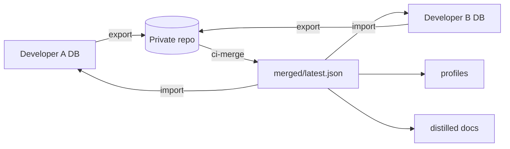

# claude-mem-sync

Team memory sharing for `claude-mem`: sync AI memories across developers via Git.

::: callout info "What it does" icon:brain-circuit
`claude-mem-sync` exports selected local observations, merges and deduplicates them in a private Git repository, then imports the merged memory set back into each developer's local `claude-mem.db`.
:::

::: grids
::: grid
::: card "Start" icon:zap
Install the plugin, run `mem-sync init`, create a shared repository, then preview before export.
:::
::: card "Share safely" icon:shield
Use filters, private repositories, PR review, and explicit external API opt-in.
:::
::: card "Operate" icon:workflow
Run CI merge, profiles, dashboard, and optional distillation from deterministic artifacts.
:::
:::
:::

::: tabs
== tab "Developers"
Use `preview`, `export`, `import`, `status`, and `dashboard`.

== tab "Maintainers"
Set up repository layout, CI templates, merge caps, schedules, and review policy.

== tab "Reviewers"
Inspect contribution PRs and distilled rules before they become shared team knowledge.
:::
