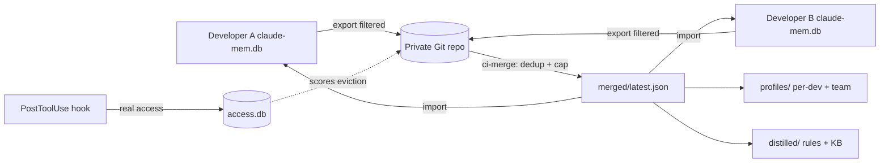

# claude-mem-sync


> **claude-mem-sync turns `claude-mem`'s single-developer memory into shared team knowledge.**
> It exports the AI memories that matter, merges and deduplicates them in a **private Git repo**, then
> imports the merged set back into every developer's local `claude-mem.db` — with eviction scoring,
> developer profiles, LLM-distilled rules and a dashboard. Git-native, privacy-first, zero servers.

::: callout info "New here? Read this page top to bottom" icon:compass
In five minutes you'll know exactly what this tool is, the problem it solves, why it beats every "just
copy the database" workaround, and where to click next. Every other page goes deeper — this one gives
you the whole picture.
:::

---

## What it is — in one minute

`claude-mem` gives Claude persistent memory across sessions, storing observations — decisions, bugfixes,
discoveries — in a **local SQLite database**. It's brilliant, and it's **single-user, per-machine**.

So on a real team, the knowledge never travels. Developer A discovers a critical pattern; developers B
through L never learn it. The same bug gets rediscovered. The same decision gets re-debated. There is
no native team mode, no shared database, no automatic sync.

`claude-mem-sync` closes that gap using **Git as the transport layer**:

- **Export what matters** — filter your local observations by type, keyword or tag, score them, and push
  only the curated set to a private repo. Empty filters export *nothing* — you never leak by accident.
- **Merge in CI** — a merge bot deduplicates across developers (composite-key, not auto-increment IDs),
  caps the set with eviction scoring, and produces one `merged/latest.json` per project.
- **Import back in** — every developer pulls the merged set into their own `claude-mem.db`, so Claude
  picks up the whole team's discoveries on the next session.

> **In one line:** *the team-memory layer `claude-mem` is missing — export, merge, dedup and import AI
> memories across your whole team, over Git, with profiles and distilled rules on top.*

---

## The problem it solves

Every team that adopts `claude-mem` hits the same wall: memory is local, siloed and impossible to share
safely. Here is the gap this tool closes.

| Without claude-mem-sync | With claude-mem-sync |
|---|---|
| Each developer's memory lives in their own SQLite DB — knowledge never crosses machines. | Curated observations sync across the team via a private Git repo and land in every local DB. |
| Copying the whole `.db` around shares secrets, noise and another dev's half-baked notes. | **Filtered export** by type / keyword / tag shares only what matters; empty filters share nothing. |
| Twelve developers syncing weekly would bloat the DB into thousands of stale rows. | **Eviction scoring + a per-project cap** keep the merged set bounded; `#keep` protects the essentials. |
| Naïve merging duplicates the same memory once per developer. | **Composite-key dedup** (`session + title + created_at`) collapses duplicates across machines. |
| You have no idea which memories Claude actually uses. | A **PostToolUse hook** tracks real access, so used memories score higher and survive longer. |
| The team's hard-won patterns stay locked in raw observations. | **LLM distillation** turns merged memories into CLAUDE.md-ready rules and a knowledge base (opt-in). |
| No visibility into who knows what or where the bus-factor risk is. | **Developer profiles + a dashboard** surface knowledge spectrum, concept gaps and contribution quality. |

---

## Who it's for

::: grids
  ::: grid
    ::: card "Teams on claude-mem" icon:users
    Already using `claude-mem` across a team? Point everyone at one private repo with their own `devName` and curated patterns flow to every machine — no shared server, no database surgery.
    :::
  :::
  ::: grid
    ::: card "Solo devs across machines" icon:laptop
    Laptop, desktop, work box — keep one curated memory set in sync everywhere through a private repo, instead of carrying a SQLite file around by hand.
    :::
  :::
  ::: grid
    ::: card "AI-assisted engineering teams" icon:bot
    Make Claude smarter for the whole team: the decisions and bugfixes one person teaches Claude become context every teammate's Claude session can use.
    :::
  :::
  ::: grid
    ::: card "Tech leads & platform owners" icon:shield-check
    Govern what gets shared with filters and PR review, surface knowledge gaps and bus-factor risk with profiles, and distill team rules — all from artifacts you own in your own repo.
    :::
  :::
:::

---

## Why it's different — the moats

Most "memory sync" ideas are just *copy the database and hope*. This tool curates, scores, deduplicates
and governs — and never needs a server.

::: grids
  ::: grid
    ::: card "Git is the only backend" icon:git-branch
    No server, no SaaS, no shared database to operate. A **private Git repo** is the transport — clone, push, pull. GitHub, GitLab and Bitbucket (incl. self-hosted) are all supported.
    :::
  :::
  ::: grid
    ::: card "Filtered, never-leak export" icon:filter
    You share by **type, keyword or tag** (OR-combined). Empty filters export **nothing** by design — a safe default that makes accidental data leaks impossible, not just unlikely.
    :::
  :::
  ::: grid
    ::: card "Eviction scoring keeps it lean" icon:gauge
    A scoring model (type × recency × access *or* diffusion) caps each project so the merged set never bloats. `#keep` pins critical memories with `score = Infinity` so they're never pruned.
    :::
  :::
  ::: grid
    ::: card "Dedup that survives machines" icon:layers
    Duplicates collapse on a **composite key** (`sdk_session_id + title + created_at`), not the local auto-increment `id` — so the same memory exported by five devs becomes one row, every time.
    :::
  :::
  ::: grid
    ::: card "Real-usage access tracking" icon:activity
    A PostToolUse hook records which memories Claude **actually reads**, into a separate `access.db` that never touches claude-mem's schema. Used memories score higher and outlive noise.
    :::
  :::
  ::: grid
    ::: card "Read-only by default, safe writes" icon:shield
    Export and the hook are **read-only** on `claude-mem.db`. Import is the only writer — wrapped in a transaction with rollback safety. Your source memory is never put at risk.
    :::
  :::
  ::: grid
    ::: card "Developer profiles, zero cost" icon:chart-pie
    Deterministic per-dev metrics — knowledge spectrum, concept map, file coverage, temporal pattern, survival rate — plus team aggregates and **bus-factor knowledge-gap** detection. No LLM, no API spend.
    :::
  :::
  ::: grid
    ::: card "Opt-in LLM distillation" icon:sparkles
    Turn merged memories into **CLAUDE.md-ready rules** and a grouped knowledge base — double opt-in, delivered as a PR (never auto-merged), with no code, file paths or dev names in the output.
    :::
  :::
  ::: grid
    ::: card "A dashboard that reads your data" icon:layout-dashboard
    A 9-tab dark-theme SPA — overview, observations, search, analytics, access heatmap, sync history, profiles, team insights, distilled — served straight from your local DBs and repo artifacts.
    :::
  :::
:::

---

## See it

A local, zero-framework dashboard (`mem-sync dashboard`) visualizes everything — observations, access
patterns, developer profiles and distilled knowledge — read directly from your local databases.


---

## claude-mem-sync vs. the alternatives

| Capability | **claude-mem-sync** | No sync (default claude-mem) | Copy the `.db` by hand | Cloud "AI memory" SaaS |
|---|:---:|:---:|:---:|:---:|
| Share memories across a whole team | ✅ | ❌ | ➖ | ✅ |
| Filtered, never-leak export (type/keyword/tag) | ✅ | ❌ | ❌ | ➖ |
| Cross-machine dedup (composite key) | ✅ | ❌ | ❌ | ➖ |
| Eviction scoring + per-project cap | ✅ | ❌ | ❌ | ➖ |
| Real-usage access tracking (hook) | ✅ | ❌ | ❌ | ➖ |
| Developer profiles + knowledge-gap detection | ✅ | ❌ | ❌ | ➖ |
| Self-hosted, you own the data (private Git repo) | ✅ | ✅ | ✅ | ❌ |
| No server / no SaaS to operate | ✅ | ✅ | ✅ | ❌ |

> Legend: ✅ built-in · ➖ partial / manual / not exposed · ❌ not available.

---

## How it fits together

Each developer exports a filtered, scored slice to a private repo. A CI merge bot deduplicates and caps
it into one merged set, which everyone imports back — and which feeds profiles and distilled docs.



The eviction score that keeps the merged set bounded:

$$
score = (type \times w_t) + (recency \times w_r) + (access \;|\; diffusion) \times w_3
$$

---

## Start in 30 seconds

::: steps
1. **Install the plugin + CLI**
   ```bash
   claude plugin marketplace add lopadova/claude-mem-sync
   claude plugin install claude-mem-sync@claude-mem-sync
   ```
   This installs the Claude Code plugin (the access-tracking hook) **and** the `mem-sync` CLI globally.
   Verify with `mem-sync --help`. (Requires Node ≥ 18 on your `PATH`; Bun is recommended.)

2. **Run the setup wizard**
   ```bash
   mem-sync init
   ```
   Pick your `devName`, confirm your `claude-mem.db` path, and add a project pointing at a **private**
   repo (`owner/name`) with your export filters.

3. **Preview, then export and import**
   ```bash
   mem-sync preview --project my-app   # always preview first — confirm your filters
   mem-sync export  --project my-app   # push your curated slice
   mem-sync import  --all              # pull the team's merged memories back in
   ```
:::

**[→ Quickstart](/get-started/quickstart)** · **[→ Installation](/get-started/installation)** · **[→ First Team Repository](/guides/team-repository)**

---

## Batteries included for AI-assisted development

This repo ships **AI batteries** — a `CLAUDE.md` working guide and an invocable `.claude/skills/`
`docmd-docs` skill encoding the house rules: read-only access to claude-mem's DB, array-based command
execution (no shell injection), composite-key dedup, never-leak filter defaults and the docs-sync
discipline. Open the package in Claude Code, Cursor, Copilot or Codex and your agent already knows them.

---

## Where to go next

::: grids
  ::: grid
    ::: card "Quickstart" icon:zap
    Install, configure and run your first export/import in minutes. **[Open →](/get-started/quickstart)**
    :::
  :::
  ::: grid
    ::: card "Memory Sync Model" icon:network
    The theory behind filtered export, cross-machine dedup and the eviction-scoring model. **[Read →](/concepts/memory-sync-model)**
    :::
  :::
  ::: grid
    ::: card "Architecture" icon:boxes
    The pipelines, the read-only invariants, and the ADRs behind the design. **[Explore →](/architecture/overview)**
    :::
  :::
:::

::: callout tip "Project facts" icon:info
npm `@lopadova/claude-mem-sync` · CLI `mem-sync` · Runtime Bun `1.0+` or Node `≥18` · MIT ·
[GitHub](https://github.com/lopadova/claude-mem-sync) ·
[claude-mem](https://docs.claude-mem.ai)
:::
