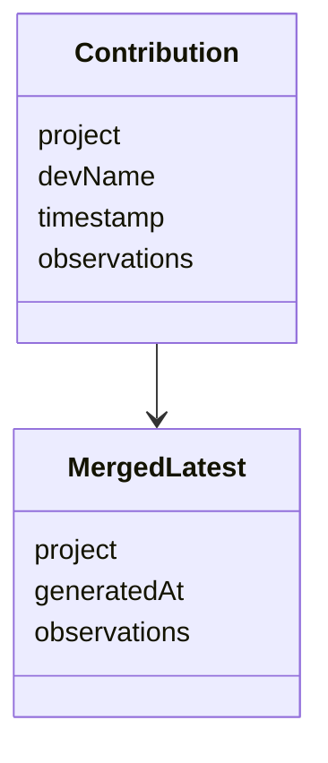

# Repository Contract

```text
contributions/{project}/{devName}/{timestamp}.json
merged/{project}/latest.json
profiles/{project}/{devName}/profile.json
profiles/{project}/team-overview.json
distilled/{project}/rules.md
distilled/{project}/knowledge-base.md
distilled/{project}/distillation-report.json
distilled/{project}/feedback.json
```

::: callout info "Ownership"
Contribution files are developer-owned evidence. Merged, profile, and distilled files are generated artifacts.
:::


